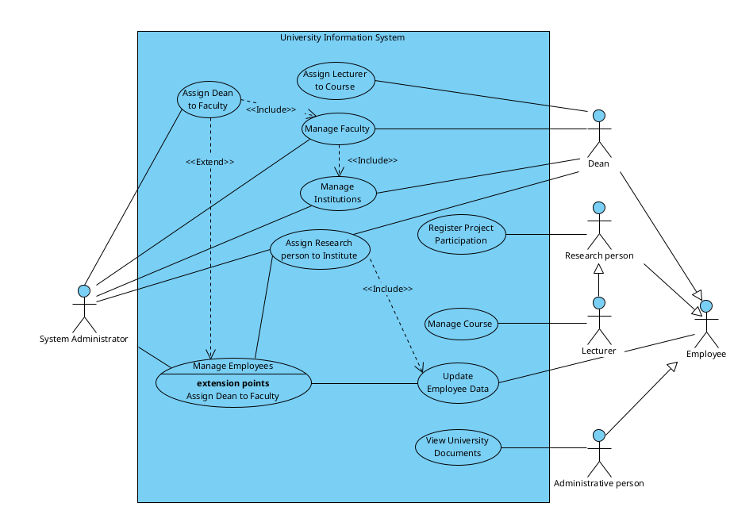
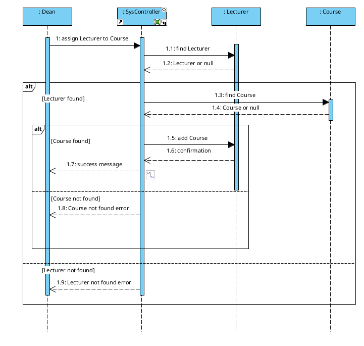
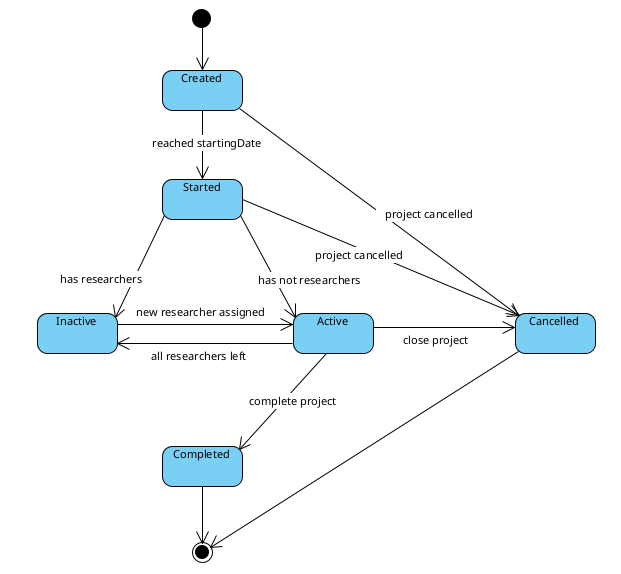
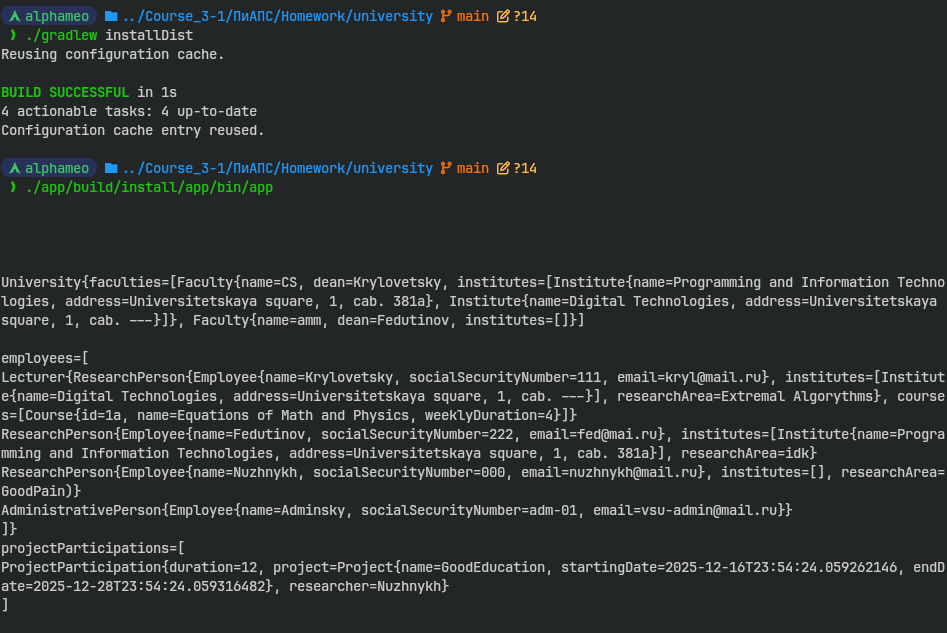
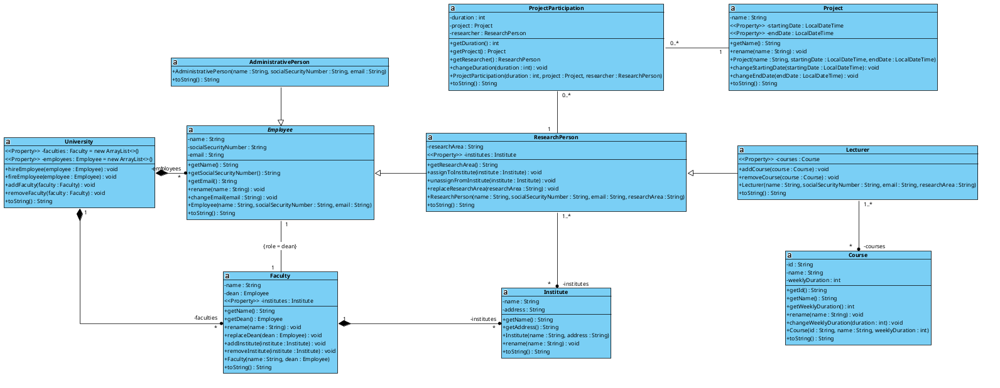

# Simple model of University System

Lab on Design and Architecture of Programming Systems

## Class Diagram

## Use Case Diagram

## Sequence Diagram

## State Machine Diagram

## Code version

## Reverse engineered Class diagram

